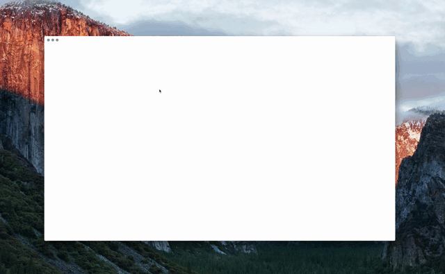

<h3 align="center">
	Mjml app
</h3>

<p align="center">
  <a href="https://travis-ci.org/mjmlio/mjml-app"></a>
  <a href="http://starveller.sigsev.io/mjmlio/mjml-app"></a>
</p>

<br />

<p align="center">
  
</p>

<br />

<p align="center">
	The first MJML Email Editor
</p>

<br />

This is a shinny live editor for the [MJML](https://github.com/mjmlio/mjml) markup language.
It allows you to create responsive emails with a live preview on both mobile and Desktop view.

### Installation

Visit the [website](http://mjmlio.github.io/mjml-app/) to download the version that fits your platform, or just go to the release page

### Build from source

``` bash

$ git clone <repo> mjml-app && cd mjml-app
$ npm install && npm run package

# an executable will be created in the `release` folder.

```

## Features

#### Template Manager
Create your own template gallery in your local environment

#### Live reload:
The app auto reload your template when you stop writing for a short amount of time

#### Themes
You can customize your environment by choosing your favorite theme under the setting tab in the editor

#### Send Test emsils
Using a Mailjet account, send your template right to your inbox.

#### Gist integration
Export your template in a gist to be able to share it with your friends

## Contribute
We highly recommend this project to anyone willing to start learning React/Redux or electron. It is a really and easy cool ecosystem.

#### Step 1:
Open a terminal, clone this repository, go into the generated folder, and run
``` bash

npm install && npm run dev

```
Wait for a few second, focus on the newly created window and hit Cmd+R to refresh the app.
It will start a new development server that will allow you to live reload the app when you change the code.

#### Step 2
Open your Favorite text editor (we use Vim because it is simply better), and start playing around with the code

#### Step 3
Once you have your feature ready, run

``` bash

npm run lint

```
Yes, dangling-commas on, sorry haters!

#### Step 4
Package your app, make sure it works, and create a pull request


### Releases and Changelogs

### 1.1.2
 - New Design for modals 💡
 - Home is the new AppData 🍊
 - Developer config folder is separated from the prod one 💉
 - EsDoc compilant comments 📄
 - Redux crash report middleware 💥

#### 1.1.1
 - Prevent drag'n'drop on the app ☂
 - added dmg build config for OSX ❤️
 - Better Error handling on the editor 🛡

#### 1.0.0
 - Templates manager on the Home Page 🖼
 - Mobile/Desktop preview 📲
 - Live reloading 🏃
 - Auto save 😄
 - Theme manager 🖼
 - Test email 💬
 - Export as Gist 🍊
