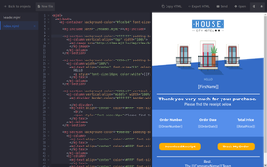

<h1 align="center">
	MJML App
	<a href="https://travis-ci.org/mjmlio/mjml-app"></a>
</h1>


<p align="center">
	:email: The desktop app for MJML -
	<a href="https://github.com/mjmlio/mjml-app/releases">Download</a>
</p>



See [CHANGELOG.md](CHANGELOG.md) for releases details.

## Installation

Visit the [website](http://mjmlio.github.io/mjml-app/) to download the version that fits your platform, or just [go to the release page](https://github.com/mjmlio/mjml-app/releases).

### Build from source

```bash
# install dependencies
yarn

# build for your platform
yarn dist

# the binary can be found in the release/ folder
```

### Development

```bash
# launch the dev server and the electron renderer
yarn dev
```

For contributing, make sure that your commit passes the `yarn lint` and `yarn prettier` command :smile:.
